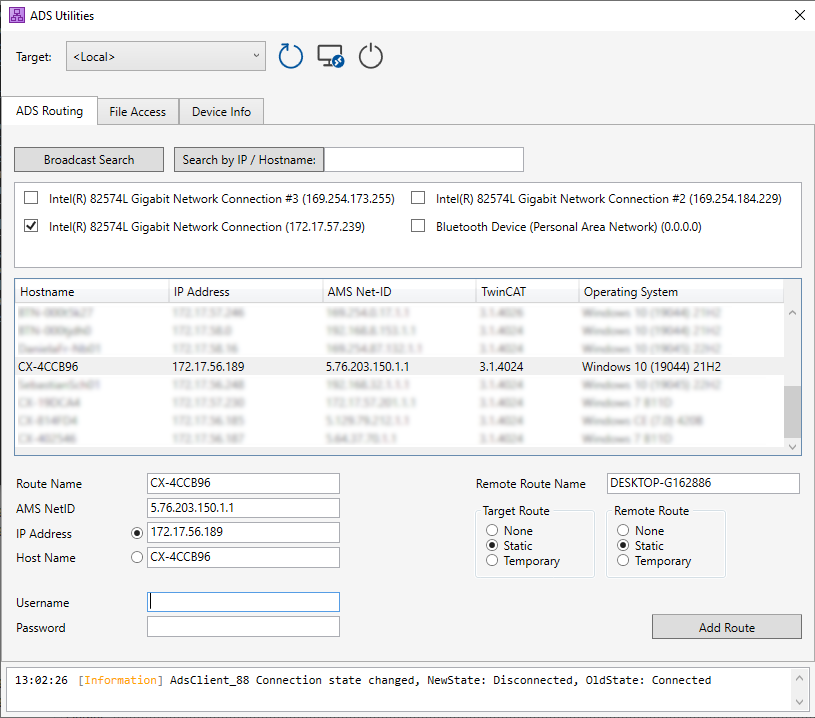
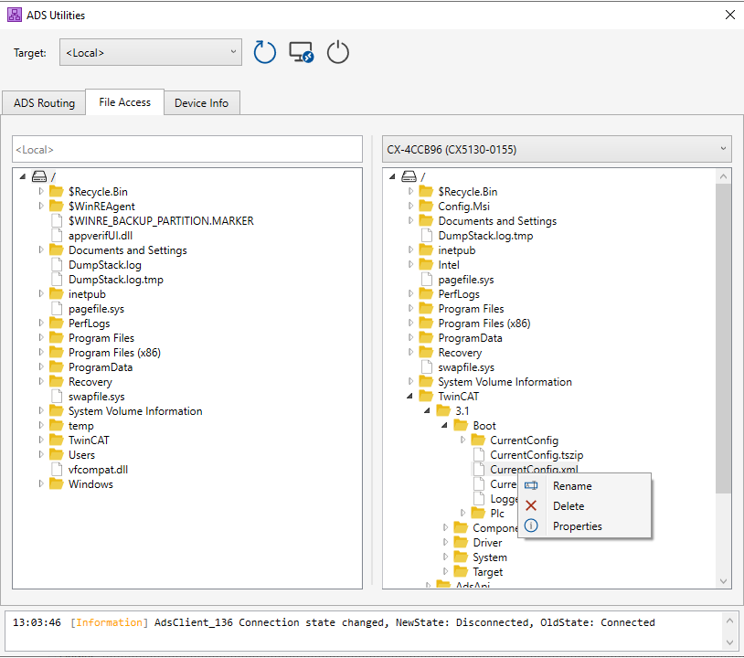

<br />
<div align="center">

  <h2 align="center">TwinCAT-ADS-Utilities</h2>

  <p align="center">
    A sample project on how to use Beckhoff's ADS API for handling aspects of the daily work with Beckhoff PLCs. Providing access to TwinCAT-route-management, I/O devices, remote file systems and more
  </p>
</div>


<!-- ABOUT THE PROJECT -->
## About The Project

ADS serves as a communication layer for many of TwinCAT's basic functionalities outside the real-time environment. This project provides a collection of ADS client wrappers that allow access to these functions via a .NET class library or a via basic UI. It uses the .Net API provided by [Beckhoff.TwinCAT.Ads](https://www.nuget.org/packages/Beckhoff.TwinCAT.Ads/). Comprehensive documentation for the ADS API is available on [infosys.beckhoff.com](https://infosys.beckhoff.com/).

### Features
* __Remote File System Access:__ Interact with the file system and registry of your PLCs remotely.
* __ADS Route Management:__ Configure and manage ADS routes to and between PLCs.
* __I/O Configuration:__ Read the I/O configuration of remote systems without the need for TwinCAT XAE.
* __System Parameters & Diagnostics:__ Monitor system parameters, utilization, and access diagnostic functions of your PLCs.


### Prerequisites

* Beckhoff TwinCAT-System-Service installed (comes with any TwinCAT installation)


<!-- USAGE EXAMPLES -->
## Examples

#### Copy a file to a remote system
```csharp
AdsFileClient sourceFileClient = new();
await sourceFileClient.Connect(AmsNetId.Local.ToString());

AdsFileClient destinationFileClient = new();
await destinationFileClient.Connect("192.168.1.100.1.1");

await sourceFileClient.FileCopyAsync(@"C:/temp/existingFile.txt", destinationFileClient, @"C:/temp/copiedFile.txt");
```

#### Perform a broadcast search
```csharp
AdsRoutingClient localRouting = new();
await localRouting.Connect(AmsNetId.Local.ToString());

// As List
var devicesFound = await localRouting.AdsBroadcastSearchAsync(secondsTimeout: 5);
foreach (TargetInfo device in devicesFound)
    Console.WriteLine(device.Name);

// As Async Enumerable
await foreach (TargetInfo device in localRouting.AdsBroadcastSearchStreamAsync(secondsTimeout: 5))
    Console.WriteLine(device.Name);
 ```

#### Add an ADS route to a remote system
```csharp
AdsRoutingClient localRouting = new();
await localRouting.Connect(AmsNetId.Local.ToString());

await localRouting.AddRouteByIpAsync("192.168.1.100.1.1", "192.168.1.100", "IPC-Office", "Admin", passwordSecStr);
```

<!-- GUI EXAMPLES -->
## GUI





